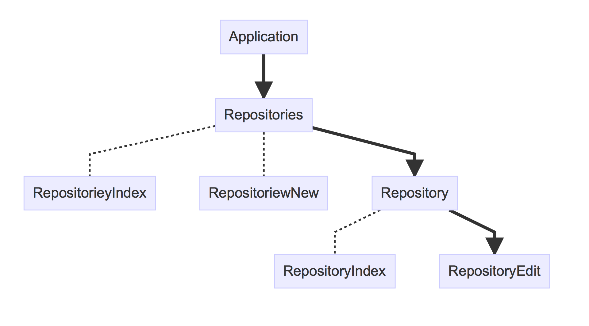
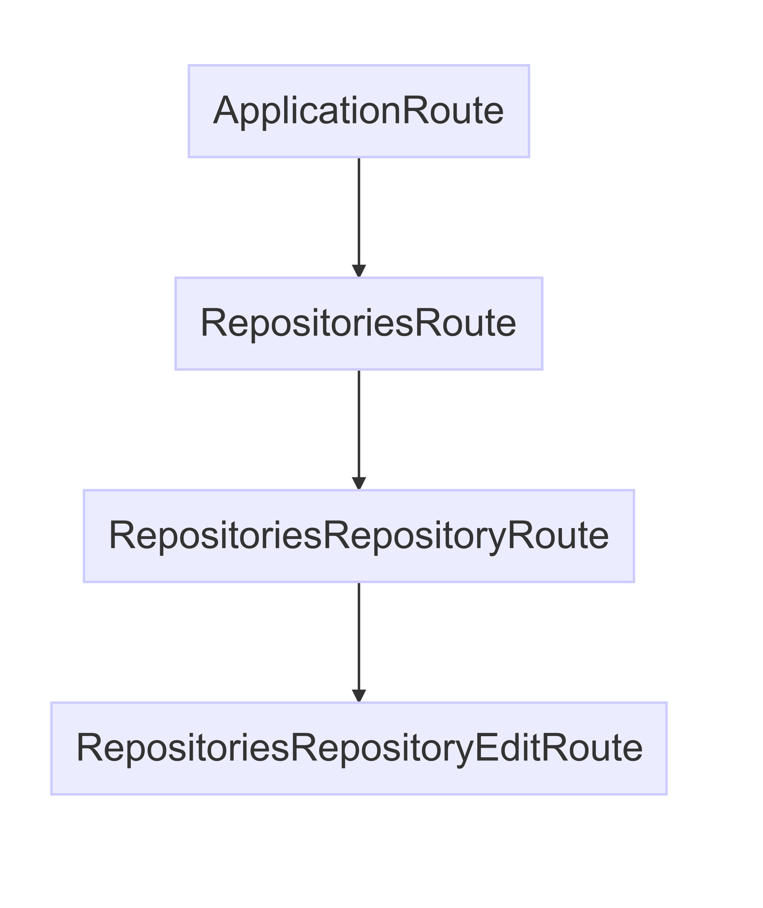
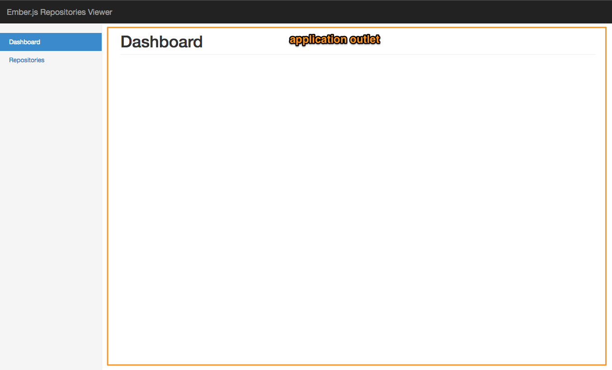
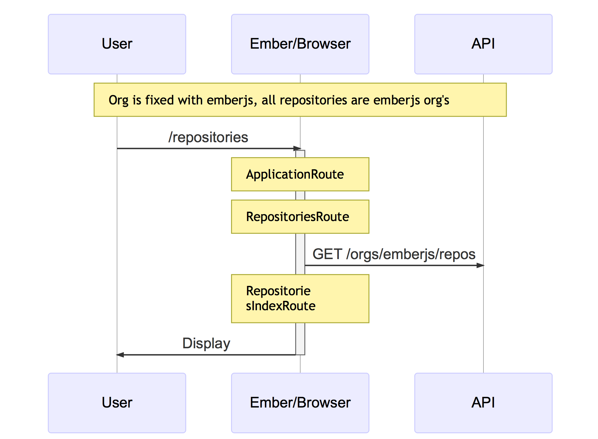
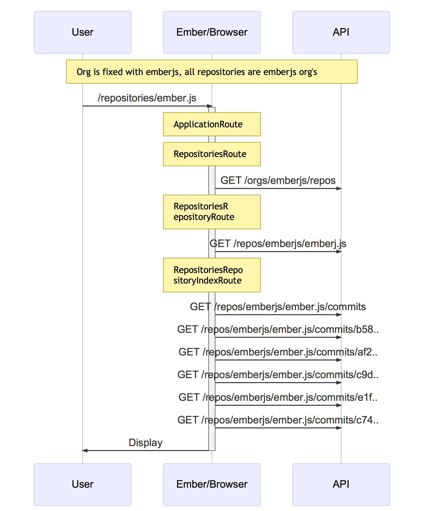

# Ember.js

The Second Step (Router, Route and etc)

>https://github.com/dopin/ember-tokyo-reborn/

>https://github.com/dopin/ember-tokyo-reborn/blob/master/presentation.md


---

### お品書き(1/)

- 自己紹介
- Ember.js Tokyoについて
- このスライドの対象者
- 免責事項
- Emberについて
- Ember.jsの各コンポーネントの役割と関連するCoCの説明

---

### お品書き(2/)

- Router Route Template Componentの雑な説明
- シンプルなRouteの例
- Nested Routeの例
- サンプルアプリでRouter/Route/Templateを説明
  - Rails developerが混乱するところもピックアップ

---

### お品書き(3/)

- Router Route Templateのまとめ
- Convention of model hook
- ajaxはどこでやるべきか
- その他のComponentを雑に説明
  - Ember.Object Mixin Service
  - Store Model Adapter Serializer Deserializer
  - Addon etc...

---

### お品書き(4/4)

- モデルのソートはどこですべきか？
- モデルのフィルターはどこですべきか？
- :ice_cream: 本日のデザート(ありません)

お腹いっぱいで帰ってください。

---

### 自己紹介

- Murasaki-san / dopin / whatever
- New Organizer :flushed: Help me!
- Freelance / Ember.js Rails developer
- I :heart_eyes: :sake: :wine_glass: and :yen:, :dog2: :cat2: but :no_good: :smoking:
- I wanna be a good guy in Splatoon always. =>

---

### Ember.js Tokyo

- :tada: Reborn!!
- Next March 22nd 2017 at Sakura internet
- Next Next late in May 2017 at Sakra internet
- We're looking for companies which provide us venue. :eyes: :bow:
- Stay tuned
- https://ember-japan-community-slackin.herokuapp.com/

---

### 余談

- 私の個人的な思い
- 昔:Railsを始めたけど、学ぶことが多い(Ruby、SQL、セキュリティ...)
- 今:Emberも似ている(ES6、SPA、非同期プログラミング...)
- Railsを学んで良かった使って良かった
- Emberもそう、だから手助けになれば幸い
- 楽な道じゃないけど頑張ろうぜ

---

## このスライドの対象者

- Ember.jsでWebアプリをEmber-CLIを使って開発したことがあり、
- Emberのファイル構成を知っているが、
- いまいちEmberでのやり方がわからないという方
- Railsでいう `resources :post` をEmberでどうやるのかわからない方

---

### 免責事項

:hand:

- ところどころRailsとの違いを説明しますが、RailsのMVCは忘れてください(違うものです)
- ディレクトリ構造やファイル名の規約については省きます
- 今回は主にRouter/Route/Template(outlet)に焦点を当てています
- I'm not an Ember.js committer but just a user :flushed:
- 嘘言ってたらごめんなさい :bow:

---

### 免責事項

:hand:

- 以下の話はしません :scissors:
  - Route transition
  - queryParams

大事な機能なのであえて触れておきました :bow:

---

## Ember

* CoCがあるフレームワーク
* RailsのようにURLから使われいるものがどこにあるのかが分かる
* ディレクトリ構造とファイル名に決まりがあるので迷わない
* 逆にCoCを知らないと迷ったり分からなくなる
* 今回はEmberのCoCと各コンポーネント(MVCなど)を説明していきます

---

## Emberのコンポーネント

- Router Route Template Controller　Component
- Ember.Object
- Model Serializer Adapter Store
- Service Mixin
- Initializer
- etc... a lot!!

---

## 最初に知っておくべきもの

* Router
* Route
* Template
* Controller
* これらの役割とCoC(Ember-CLIのファイルの命名規約も)
* Componentの使い方と活用方法
  * これはTemplateとControllerを知っていれば割と簡単 

---

## その次は

* Railsでいう `resources :posts` (CRUD) をEmberで実現する方法
* Routeの使い方と各Routeとの関係

今回のメイントピックです！

---

## さらにその次は

* Ember-DATA, Model, Store, Serializer, Adapter...
* Service, Initializer
* Ember.Object, Ember.RSVP.*, etc...

ひとまず、 **最初に知っておくべきもの** からやっつけていきましょう

---

## Router

* 各URL(Route)の定義を行う
* Railsでいう `config/routes.rb` に相当
* Routeの定義をすると、Route/Controllerも作られる
  * Railsとは違いRouteとControllerはコード存在しなくても良い
  * ない場合はデフォルトのものが使用される

---

## Router

```js
// app/router.js
Ember.Router.map(function() {
  this.route('hello-world');
});
```

```hbs
{{!-- app/templates/hello-world.hbs --}}
<h1>Hello World</h1>
```

* http://localhost:4200/hello-world
* CoCに沿って、`app/templates/hello-world.hbs` が参照され、ブラウザにHello Worldと表示される

^
この仕組みはEmberを少し触ったことがある方はご存知かと思います。
hello-world routeを定義し、hello-world.hbsを作成すると、それ以外のコードを書かなくても、/hello-worldにアクセスすれば、hello-worold.hbsの中身が表示されます。
裏側で何が起きているかは後ほど説明します。
You might know this behavior if you aleady tried Ember.
Without writing other code, Ember will display Hello World on the browser when you access to /hello-world.
I'm going to talk about the background of this feature later.

---

### Router: Route Name

- routeを宣言すると使える
- link-to transitionTo modelForなどで使う
- さりげなく出てくるので、わからない時は質問してください :bow:

```hbs
{{link-to 'Go to hello world' 'hello-world'}}
                               ^^^^^^^^^^^
{{link-to 'Post index' 'posts'}}
                        ^^^^^
```

---

## Template

* Handlebars
* Controllerのプロパティを表示したり
* HelperやComponentを使ったり
* `{{action}}` を使ってDOMイベントをController/Routeに処理を任せる

---

### Actions


```hbs
{{!-- app/templates/application.hbs --}}
<form {{action "save" on="submit"}}>
{{input value=model.name}}
</form>
```

---

## Route

* 各URL毎に存在する
* 暗黙的に作られるRouteがある(index)
* Emberを理解するには、まずRouteをしっかり理解する必要がある

---

### Routeの役割

* データの取得(ajax)
* テンプレートの描画
* テンプレート内の `{{action}}` を実行するなど
* これらの画面の遷移に応じたフックメソッドがある
* イベントや状態によって別画面に遷移させたり
* RailsのController部分を担当しているとも言える(かな？)

---

### Handling Actions

```hbs
{{!-- app/templates/application.hbs --}}
<form {{action "save" on="submit"}}>
{{input value=model.name}}
</form>
```

```js
// app/routes/application.js
Ember.Route.extend({
  actions: {
    save() {
      this.get('controller.model').save();
    }
  }
});
```

---

### Route hook methods (events)

- beforeModel
- model
- afterModel
- setupController
- renderTemplate
- willTransition... etc

---

### Route hook methods (events)

## :information_desk_person:

- Route#model(フック) と EmberDATAのModel(クラス)とを混同しないようにしましょう
- Modelは必須ではありません（条件あり)
  - storeを使わない(個人的には使用すべきだと思う)
  - link-to transitionToなどでinteger/string以外を渡さない


---

### Routeがやっていること

(正確なコードではありません)

```js
export default Ember.Route.extend({
  model() {
    return null;
  },
  
  setupController(controller, model) {
    controller.set('model', model); // null
  },

  renderTemplate() {
    this.render();
  }
});
```

---

### Route#modelを理解する

- 画面に必要なデータは基本modelで行う
- Promiseとそれ以外では挙動が違う
- 大事なので詳しく

---

### Route#modelを理解する

Promise: 解決したら次へ

```js
model() {
  return new Ember.RSVP.Promise( (resolve, reject) => {
    resolve( [ { "data": [] }]);
    // reject('error'); // エラー処理へ
  });
}
```

Other: 即次へ

```js
model() {
  return [ { "data": [] }];
}
```


- 次 = afterModel -> setupController -> renderTemplate

---

### Route#model Promise

```js
// parent
model() {
  this.get('ajax').request('/repositories');
}

// child
model (params) {
  this.modelFor('parent').findBy('id', params.id);
}
```

- 子Route#modelは親Route#modelが解決してから実行される

---

## Controller

* RouteとTemplateの間に存在しているイメージ
* Template内で `{{foo}}` のように値を参照している場合、Controllerのプロパティが参照される
* Routeの `setupController` フックによって、`model` フックで取得したデータはControllerの `model` プロパティに格納される

---

## Controller

* Route同様Template内のアクションをハンドリングする
  * RouteよりControllerが優先される
  * Controllerにない場合はRouteに伝達される
* Controllerを使わなくて済むなら使わない方が良い(かな？)

---

### Router, Route & Template

* シンプルな画面は、Routerでrouteの定義とtemplateさえあればOK
* 1画面、1route, 1template, 1controllerと捉えておいてOK
  * ただしネストがある
  * 慣れるまではEmber InspectorのView Tree、Routeを活用しよう

---

### Component

* ControllerとTemplateがRouteと切り離されて統合され再利用しやすくなったもの(Ember流WebComponent)
* 画面上の小さな部品から少し大きめの複雑なものがある
  * Data Down Actions Up / Smart component
* input link-to などEmberのビルトインコンポーネント
* Component名はダッシュ(-)で区切られた2つ以上単語が必須
  * my-component

---

# 裏側に潜入

一旦ここで、Emberが裏側で何をしているのか、先ほどのHello World例も含めもう少し詳しく見ていきます。

---

## 例1 テンプレート描画の流れ


* `ember new $app_name`
* `ember s`
* `open http://localhost:4200/`

---

* トップページにアクセスすると以下のように実行される


---

### behind the scenes

こんなコードが裏で動いています(正確ではありません)

```js
// app/routes/application.js
Ember.Route.extend({
  renderTemplate() {
    this.render('application');
  },
});
```

```js
// app/routes/index.js
Ember.Route.extend({
  renderTemplate() {
    this.render('index', {
      into: 'application',
      outlet: 'main',
      controller: 'index',
    });
  },
});
```

---

### behind the scenes

```hbs
{{!-- app/templates/application.hbs --}}
<section>
  {{outlet}}
</section>
```


```hbs
{{!-- app/templates/index.hbs --}}
<h1>Index</h1>
```

```html
<!-- 出力: output -->
<section>
  <h1>Index</h1>
</section>
```

* `{{outlet}}` と `{{outlet 'main'}}` は同じ

---

## 例2 Routeを1つ定義してみる

`ember g route hello-World`


```js
Ember.Router.map(function() {
  this.route('hello-world');
});
```

- :bomb: アンダーバー（hello_wolrd)も使えますが、**ファイル名はダッシュ**(hello-world)なので注意しましょう

---

* `/hello-world` にアクセスすると以下のように実行される


---

基本がわかったところで、さらに実践的なRouteを定義してみましょう

わからん:anger:という方はEmber Inspectorとにらめっこしてください :bow:

あと `ember g --dry-run ...` も :bow:

---


## Nested Route

リポジトリの一覧と詳細、編集ページの構成例(あるある)

| path | description |
| --- | --- |
| /repositories | リポジトリ一覧 |
| /repositories/new | リポジトリ新規作成 |
| /repositories/:id | リポジトリ詳細 |
| /repositories/:id/edit | リポジトリ編集 |

---

### Railsだとこう？

```ruby
# config/routes.rb
resources :repository,
          only: [:index, :show, :edit, :new]
```

---

### Emberだとこう

```js
// app/router.js
Ember.Router.map(function() {
  this.route('repositories', function() {
    this.route('new');
    this.route('repository', { path: '/:id' },　function() {
      this.route('edit');
    };
  });
});
```

---

### Rails's CoC

| path | controller | view |
| --- | --- | --- |
| /repositories | repositories#index | repositories/index.html.erb |
| /repositories/new | repositories#new | repositories/new.html.erb |
| /repositories/1 | repositories#show | repositories/edit.html.erb / repositories/repository/index.hbs  |
| /repositories/1/edit | repositories#edit | repositories/repository/edit.hbs |

* Railsは `app/views/layouts/application.html.erb` の内に `yield` で各テンプレートを描画する


---

### Ember's CoC

| path | route | controller | template |
| --- | --- | --- | --- |
| /repositories | RepositoriesRoute | RepositoriesController |  repositories.hbs |
| /repositories | RepositoriesIndexRoute | RepositoriesIndexController | repositories/index.hbs |
| /repositories/new | RepositoriesNewRoute | RepositoriesNewController | repositories/new.hbs |
| /repositories/1 | RepositoriesRepositoryRoute | RepositoriesRepositoryController | repositories/repository.hbs  |
| /repositories/1 | RepositoriesRepositoryIndexRoute | RepositoriesRepositoryIndexController |  repositories/repository/index.hbs  |
| /repositories/1/edit | RepositoriesRepositoryEditRoute | RepositoriesRepositoryEditController | repositories/repository/edit.hbs |

---

### Ember's CoC

* Emberは、親Routeのテンプレート内の `{{outlet}}` にテンプレートを描画する
* 親Routeに `{{outlet}}` がないとそれ以降の子Routeのテンプレートは表示されない
* IndexRouteはRailsでいう `show` にあたる
* HogeIndexRouteはネストしているRouteは自動で作られる

---

### Route Family

| path | route | parent |
| --- | --- | --- |
| /repositories | RepositoriesRoute | ApplicationRoute |
| /repositories/new | RepositoriesNewRoute | RepositoriesRoute  |
| /repositories/1 | RepositoriesRepositoryRoute | RepositoriesRoute |
| /repositories/1 | RepositoriesRepositoryIndexRoute | RepositoriesRepositoryRoute |
| /repositories/1/edit | RepositoriesRepositoryEditRoute | RepositoriesRepositoryRoute |

---

### Tree


---

### RepositoriesRepositoryEditRouteまでの流れ

* `/repositories/1/edit`
* ブラウザのリフレッシュか直接URLを叩いた場合、ApplicationRouteからスタートする




---

### RepositoriesRepositoryEditRouteまでの流れ




- 親Routeのフックメソッドは実行される


---

### RepositoriesIndexRouteからRepositoriesRepositoryEditRouteまでの流れ

```hbs
{{!-- app/templates/repositories/index.hbs --}}
{{link-to '変更' 'reposotories.repository.edit'}}
```

* /repositories => /repositories/:id/edit

---

### RepositoriesIndexRouteからRepositoriesRepositoryEditRouteまでの流れ


1. `RepositoriesRepositoryRoute`
2. `RepositoriesRepositoryEditRoute`

---

### Routeの理解を深める

- Nested Routeの説明をしました
- うまく説明ができないので、実際に作ったサンプルアプリを例に、どのように実装していくか見ていきましょう

---

### サンプルアプリ

- GitHubにあるemberjs orgのリポジトリ閲覧アプリ
- SPA(Ember)
- 各ページは直リンクできるようにする
- 一覧を画面左、画面右に詳細で表示されるmaster & detail形式

---

### サンプルアプリ(完成見本)


---

### サンプルアプリ

- Railsのコードについて :hand:
  - SPAと従来のWebアプリの比較用
  - データはGitHub APIからではなくDBから取得する
  - turoblinksやajaxを使わない
  - コードは想像で書いたものです

---

## Task

* GitHub APIから以下の情報を取得し画面に表示する
* emberjs orgのリポジトリ一覧ページ
* リポジトリの詳細情報ページ
* 最近のコミットを5件詳細ページに表示
* contributorsを別ページに表示

---

### Railsの処理の流れ


---

### Rails

```ruby
resources :repository, only: [:index, :show] do
  get 'contributors', on: :member
end

class RepositoriesController < ApplicationController
  before_action :set_repository, only: [:show, :contributors]
  def index
    @repositories = Repository.where(org: 'emberjs').all
  end

  private

  def set_repository
    @repository = Repository.find_by(name: params[:name])
  end
end

class Repository < ApplicationRecord
  has_many :commits
  has_many :contributors, class_name: User
end
```

---

### Rails

`repositories/show.html.erb`

```erb
<%= render 'header' %>
<h2>Recent Commits</h2>
<table>
  <thead>
    <tr>
      <th>Author</th>
      <th>Message</th>
```

`repositories/contributors.html.erb`

```erb
<%= render 'header' %>
<ul>
  <% @repository.contributors.each do |user| %>
```

---

### Emberではどうする？

- SPA
- 提供されているAPIからデータを取得する必要がある
- ページごとに必要なデータを毎回全部取得してHTMLを全置き換え？ :no_good:
- 画面に必要なデータだけ取得して、必要な部分だけ置き換える :ok_woman:

---

# Let's get started!

---

### APIからデータを取得する

GitHub APIのendpoints

| Path | Description |
| --- | --- |
| /orgs/:owner/repos | an org's repositories |
| /repos/:owner/:repo | a repository detail |
| /repos/:owner/:repo/commits | a repository's recent commits |
| /repos/:owner/:repo/commits/:sha | a repository's commit detail |

---

## App URLs

| Path | Description |
| --- | ---- |
| /repositories | emberjs org repository list |
| /repositories/:name | repository detail |
| /repositories/:name/contributors | repository contributor list |


---

### Router

```js
Router.map(function() {
  this.route('repositories', function() {
    this.route('repository', { path: '/:name' }, function() {
      this.route('contributors');
      this.route('edit');
    });
  });
});
```

---

### トップページ


---

### トップページ outlet



- application outletにindex.hbsが描画されている

---

### リポジトリ一覧の実装


---

### リポジトリ一覧


- APIからリポジトリ一覧情報を取得し表示する
- 各リポジトリの詳細ページにリンクする
- RepositoriesRepositoryRoute(詳細)の親
- 親(祖先)Routeのmodelは子Routeから参照可
  - 有効活用することで無駄なajaxが減る
  - 兄弟や子孫Routeは不可

---

### リポジトリ一覧 outlet


---

### リポジトリ一覧 (index)

- RepositoriesRouteIndexはRepositoriesRouteの子Route
- RepositoriesRouteIndexから兄弟Routeや兄弟の子孫Routeに遷移した時に、切り替えたいコンテンツはRepositoriesIndexRouteに置く
- Railsのcontroller#indexとは違うので注意
- この後もう一度indexが出てくるので、ここで理解できなくても:ok:
- 複数 = index, 単一 = show、のようなRailsの考え方は忘れてね

---

### Routeの流れ



---

### リポジトリ一覧

```js
// app/routes/repositories.js
export default Ember.Route.extend({
  ajax: Ember.inject.service(),

  model() {
    return this.get('ajax').request('https://api.github.com/orgs/emberjs/repos');
  },
});
```

---

### リポジトリ一覧

```hbs
{{!-- repositories/index.hbs --}}
<h1 class="page-header">Repositories</h1>
<div class="table-responsive">
  <table class="table table-striped">
    <thead>
      <tr>
        <th>Name</th>
        <th>Created At</th>
        <th>Updated At</th>
        <th>Issues</th>
        <th>Language</th>
      </tr>
    </thead>
    <tbody>
      {{#each model as |repo|}}
      <tr>
        <td>{{link-to repo.name 'repositories.repository' repo.name}}</td>
        <td>{{repo.created_at}}</td>
        <td>{{repo.updated_at}}</td>
        <td>{{repo.open_issues_count}}</td>
        <td>{{repo.language}}</td>
      </tr>
      {{/each}}
    </tbody>
  </table>
</div>
```

---

### リポジトリ一覧

完成! :tada: と言いたいけど...


---

### リポジトリ一覧

これだと詳細に移った後、他のリポジトリに移動するのが面倒。左側にも一覧が欲しい...


----

### リポジトリ一覧(左側)

- master & detail
- 左のナビゲーションと右の画面は同じデータを利用できる
- しかし問題が...

---

### リポジトリ一覧(左側)


---

### リポジトリ一覧(左側)

- 問題は左側のリストはrepoisotires outletの外
  - application.hbs
  - データが子孫Routeにある... 参照できない
- どうする？
  - application.hbsにoutletを追加してrenderTemplateで指定する

---

### リポジトリ一覧(左側) outlet


---

### リポジトリ一覧(左側) outlet追加

```hbs
{{!-- application.hbs --}}
<ul class="nav nav-sidebar">
  {{#active-link}}
    {{link-to 'Dashboard' 'index'}}
  {{/active-link}}
  {{#active-link}}
    {{link-to 'Repositories' 'repositories'}}
    {{outlet 'repository-list'}}
    ^^^^^^^^^^^^^^^^^^^^^^^^^^^^ 追加！
  {{/active-link}}
</ul>
```

---

### リポジトリ一覧(左側)

部分テンプレートを用意

```hbs
{{!-- repositories/-repositories-list.hbs --}}
<ul class="list-unstyled repository-list-nav">
  {{#each model as |repo| }}
    {{#active-link}}
    {{link-to repo.name 'repositories.repository' repo.name}}
    {{/active-link}}
  {{/each}}
</ul>
```


---

### リポジトリ一覧(左側)

```js
// app/routes/repositories.js
export default Ember.Route.extend({
  ajax: Ember.inject.service(),

  model() {
    return this.get('ajax').request('https://api.github.com/orgs/emberjs/repos');
  },

  renderTemplate() {
    this.render();
    this.render('repositories/-repository-list', {
      outlet: 'repository-list',
      into: 'application',
    });
  }
});
```

これでリポジトリ一覧ページは完成！ :tada:

---

### リポジトリ詳細の実装


---

### リポジトリ詳細

- リポジトリのデータは親Routeから引き継いでフィルターする
- リポジトリ一覧のデータに含まれていないデータがあるので詳細情報をAPIから取得する(画面上indexでもOK)
- Index以外の子Routeではコミット情報は画面に表示しないので、ここやると無駄になるので取得しない
- 最新のコミットを5件表示したいが、これもIndexで行う
- ページ上部はindexやコントリビュータページでも表示したい(共通部分)

---

### リポジトリ詳細 outlet


---

### Routeの流れ


---

### リポジトリ詳細

```js
// app/routes/repositories/repository.js
export default Ember.Route.extend({
  ajax: Ember.inject.service(),

  model(params) {
    let parentModel = this.modelFor('repositories');
    let repo = parentModel.findBy('name', params.name);
    return this.get('ajax').request(repo.url);
  },
});
```

---

### リポジトリ詳細

```hbs
{{!-- app/templates/repositories/repository.hbs --}}
<h1 class="page-header">{{link-to model.name 'repositories.repository' model.name}}</h1>
<ul class="list-inline">
{{#active-link}}
  {{link-to 'Collaborator' 'repositories.repository.contributors' model.name class="btn btn-default"}}
{{/active-link}}
{{#active-link}}
  {{link-to 'Edit' 'repositories.repository.edit' model.name class="btn btn-default"}}
{{/active-link}}
</ul>

{{outlet}}
```


:tada: 次はindex

---

### リポジトリ詳細 (index)の実装


---

### リポジトリ詳細 (index)

- 親Routeか単一リポジトリのデータを持っているのでそれを利用する
- modelでコミットを取得する
- コミットのメッセージも表示したいので、各コミットの詳細を取得する

---

### リポジトリ詳細 (index) Routeの流れ



---

### リポジトリ詳細 (index)Route

```js
// app/routes/repositories/repository/index.js
export default Ember.Route.extend({
  ajax: Ember.inject.service(),

  model() {
    let repo = this.modelFor('repositories.repository');
    return new Ember.RSVP.Promise((resolve, reject) => {
      let commitsUrl = `${repo.url}/commits`;
      let recentCommits = [];
      this.get('ajax').request(commitsUrl).then((commits) => {
        Ember.RSVP.all(commits.slice(0, 5).map((commit) => {
          return this.get('ajax').request(`${commitsUrl}/${commit.sha}`).then((data) => {
            recentCommits.push(data);
          });
        })).then(() =>{
          resolve({repo, commits, recentCommits});
        }).catch((error) => reject(error));
      }).catch((error) => reject(error));
    });
  }
});
```

---

### リポジトリ詳細 (index)

```hbs
{{!-- app/repositories/repository/index.hbs --}}
<h2 class="sub-header">Info</h2>

<div class="form-horizontal form-striped">
  <div class="form-group">
    <label class="col-sm-2 control-label">Watch</label>
    <div class="col-sm-10">
      <div class="checkbox">
        {{model.repo.subscribers_count}}
      </div>
    </div>
  </div>
  <div class="form-group">
    <label class="col-sm-2 control-label">Stars</label>
    <div class="col-sm-10">
      <div class="checkbox">
        {{model.repo.stargazers_count}}
      </div>
    </div>
  </div>
</div>

<h2 class="sub-header">Recent Commits</h2>

<div class="table-responsive">
  <table class="table table-striped">
    <thead>
      <tr>
        <th>Author</th>
        <th>Message</th>
      </tr>
    </thead>
    <tbody>
      {{#each model.recentCommits as |commit|}}
      <tr>
        <td>{{commit.author.login}}</td>
        <td>{{commit.commit.message}}</td>
      </tr>
      {{/each}}
    </tbody>
  </table>
</div>
```

---

### リポジトリ詳細

完成 :tada:

次はコントリビュータのページを作成しましょう

---

### リポジトリのコントリビューターの実装


---

### リポジトリのコントリビューター


---

### リポジトリのコントリビューター Routeの流れ


---

### リポジトリのコントリビューター Route

```js
// app/repositories/repository/contributors.js
export default Ember.Route.extend({
  ajax: Ember.inject.service(),

  model() {
    let repo = this.modelFor('repositories.repository');
    let url = `${repo.url}/contributors`;
    return this.get('ajax').request(url);
  }
});
```

---

### リポジトリのコントリビューター

```hbs
{{!--  app/templates/repository/contributors.js --}}
<h2>Contributors</h2>

<div class="table-responsive">
  <table class="table table-striped">
    <thead>
      <tr>
        <th>Name</th>
        <th>Contributions</th>
      </tr>
    </thead>
    <tbody>
      {{#each model as |user|}}
      <tr>
        <td>
          
          {{user.login}}
        </td>
        <td>
          {{user.contributions}}
        </td>
      </tr>
      {{/each}}
    </tbody>
  </table>
</div>
```

---

### リポジトリのコントリビューター

:tada:

---

### おまけ

- 編集画面
- ただし権限がないのでREAD Onlyで

---

### リポジトリ編集画面の実装


---

### リポジトリ編集

- データは親Routeのデータをそのまま利用できるのでajax不要
- modelフックを書く必要なし
- templateとcancelによる詳細画面への遷移処理を書けば:ok:

---

### リポジトリ編集

```js
// app/routes/repositories/repository/edit.js
export default Ember.Route.extend({
  actions: {
    cancel() {
      this.transitionTo(
        'repositories.repository',
        this.get('controller.model.name')
      );
    }
  }
});

```

---

### リポジトリ編集

```hbs
{{!-- app/repositories/respository/edit.hbs --}}
<form>
  <div class="form-group">
    <label class="control-label">Name</label>
    <input class="form-control" value={{model.name}} disabled>
  </div>
  <div class="form-group">
    <label class="control-label">Description</label>
    <textarea class="form-control"disabled></textarea>
  </div>
  <button type="button" class="btn btn-primary" disabled>Save</button>
  <button type="button" class="btn btn-default" {{action "cancel"}}>Cancel</button>
</form>
```

---

### サンプルアプリ

# 完

---

### Router Route Templateのまとめ

- この3つのコンポーネントが基本
- Nested Route
  - outlet
  - model

---

### Convention of model hook

model hook will not be executed every time.
モデルフックは毎回実行されるわけではありません。

# :scream:

 In some cases, your overriding code will be ignored.
 上書きしたコードが無視されることがあります。

---

### Convention of model hook

```js
// app/routes/repositories.js
Ember.Route.extend({
  model() { [{name: 'a'}, {name: 'b'}] }
});

// app/routes/repositories/repository.js
Ember.Route.extend({
  model(params) {
    let repo = this.modelFor('repositories').findBy('name', params.name);
    // here's the important part; ここ重要！
    return this.ajax.request(`${api}/repos/${repo.name}/`);
  }
});

// app/routes/repositories/edit.js
Ember.Route.extend({
  model() {
   return this.modelFor('repository');
  }
});
```

---

### Convention of model hook

Passing neither integer nor string

```js
this.transitionTo('repositories.repository', repo);
                                             ^^^^
```

```hbs
{{link-to 'Show' 'repositories.repository' repo}}
                                           ^^^^
```

```js
// The executed model hook will be like this.
// The ajax request will not be executed.
// app/routes/repositories/repository.js
Ember.Route.extend({
  model(params) {
    return this.modelFor('repositories').findBy('name', params.name);
  }
});
```

---

### Convention of model hook

Passing integer or string...

```js
this.transitionTo('repositories.repository', repo.name);
                                             ^^^^^^^^^
```

```hbs
{{link-to 'Show' 'repositories.repository' repo.name}}
                                           ^^^^^^^^^
```

```js
// The executed model hook will be as-is.
// app/routes/repositories/repository.js
Ember.Route.extend({
  model(params) {
    let repo = this.modelFor('repositories').findBy('name', params.name);
    return this.ajax.request(`${api}/repos/${repo.name}/`);
  }
});
```

---

### Convention of model hook

- link-to transitionToのパラメータがintかstringを渡すとmodelフックは書いたコードの通り実行される
- それ以外の時はEmberのconventionによって解決される
- 単純にoverrideしたつもりでも、挙動が呼び出し方で変わるので注意が必要 :bomb: :bomb: :bomb:
- http://emberjs.com/api/classes/Ember.Route.html#method_model

:sweat_smile:

---

### Convention of Route definition

```js
// app/router.js
this.route('posts', function() {
  this.route('post', { path: '/:post_id' });
                                ^^^^^^^
});
```

- _**model**__id
- `app/models/post.js`がないとエラーになります :innocent:

^
RepositoryIndexRouteを省略するとRepositoryRouteのmodelが使われる、ように見えます。
が、ブラウザのリフレッシュの時はそのように見えて、別のRouteからの遷移の時はmodelは親Routeから引き継がれません。
liveReloadを使っていて開発していると、その画面を開発している時は気がつきにくいので、覚えておいた方が良いですね。
親Routeのmodelに依存するときは、RouteのmodelでmodelForで明示的に呼び出します。

---

### Route#error

- ajaxリクエスト失敗時の対処
- errorのtemplate/outletは別
- `beforeModel`、 `model`、`afterModel` で返した`Promise` が `reject` されると、`error`アクションが呼ばれ、テンプレートが存在すれば描画する
- この辺は詳しくないので説明できません :bow:

---

## その他

複数のリソースを取得する例

---


### RSVP.hash :+1:

* ダッシュボードのように複数のデータを取ってくる例

```js
Ember.Route.extend({
  model() {
    return Ember.RSVP.hash({
      posts: this.get('ajax').request(`/posts`),
      users: this.get('ajax').request(`/users`),
    });
  },
});
```

---

### RSVP.Promise :+1:

* 1つのリソースとそれに紐づくデータを取得する例
* EmberDATAを使うと書かなくて済む場合が多い

```js
Ember.Route.extend({
  model(params) {
    return new Ember.RSVP.Promise((resolve, reject) => {
      this
        .get('ajax').request(`/posts/${params.id}`)
        .then((post) => {
          this.get('ajax')(post.commentUrl)
              .then((comments) => resolve({post, comments}))
              .catch((error) => reject(error));
        })
        .catch((error) => reject(error));
    });
  },
});
```


---

### afterModel :speak_no_evil:

```js
Ember.Route.extend({
  model(params) {
    return this.get('ajax').request(`/posts/${params.id}`);
  },

  afterModel(model) {
    /* afterModelでajaxはおすすめできない */
    this.get('ajax')(model.commentUrl)
        .then((comments) => {
          /* ここではcontrollerはまだ参照できない */
        });
  }
});
```

- controller.modelとして使いたい時はmodelフックで取得
- routeにセットする時はafterModel

---

### setupController :see_no_evil:

```js
Ember.Route.extend({
  model(params) {
    return { post: this.get('ajax').request(`/posts/${params.id}`) };
  },

  setupController(controller, model) {
    this._super(...arguments);
    this.get('ajax').request(model.post.commentUrl)
        .then((comments) => {
          controller.set('model', { 'post': model.post, comments});
        })
        .catch((error)=> {
          this.transitionToRoute('error'); // ? no good
          // You don't want to pass errors as a parameter.
        });
  }
});
```

---

### ajaxはどこでやるべき？

- 基本的に...
- 画面に必要なデータはRoute#model
- 保存処理などはRouteかControllerのaction内

---

### ajaxはどこでやるべき？

- なぜ？
  - ユーザのアクション次第でいつでも画面遷移できるから
  - コンポーネントでajaxして、その間に他の画面に遷移した場合、ajaxが終わってコールバック処理が走りajaxを処理していたComponentが画面から削除されていたら、どうなりますか？ `this`とか..
  - :bomb::bug::bomb::bug::bomb::bug::bomb::bug::bomb::bug:


---

### その他のコンポーネント

- Ember.Object Mixin Service
- Ember DATA = Store, Model, Adapter, Serializer, Deserializer
- Initializer
- Addon
- etc...

---

### Ember.Object

- EmberではあらゆるところでEmber.Objectが使われている
- Vanilla.jsでは機能が足りない
- Ember.***.extend, Mixin はEmber.Objectの機能
- 基本なのでガイドは読んでおきましょう
- https://guides.emberjs.com/v2.11.0/object-model/

---

### Service

- Ember.Service、Ember.Objectの拡張
- Emberアプリが使われている間ずっと単一で存在するオブジェクト
- Session, Geolocation, Websockets, サーバから送られてくる通知や
- Ember DATAの仕様にマッチしていないAPIとのやりとりに使う
- https://guides.emberjs.com/v2.11.0/applications/services/

---

### Store 

- 実はサンプルアプリには問題があります
- 仮にリポジトリ名を変更できたとします
- 先ほどの実装では左側のリストは古い名前のままで更新されません :bomb:
- ここでStore、Ember DATAの出番です

--- 
### Store

- Storeはブラウザ上のRDBMSのようなものです
- データ(モデル)を一元管理します
- データを変更するとobserverに伝播されます
- データはブラウザのメモリ上に保管されるので永続的ではありません
- データを永続化するにはajaxでサーバと通信するか、LocalStorageなどを使う必要があります

---

### Model

- モデルはAPIが提供するデータの型定義
- db/schema.rb + ActiveRecord

| DS.Model | RDBMS |
| --- | --- |
| Model | Table |
| attribute | column |
| Computed Property | ? |

---

### Model

- Post Modelの定義の例

```js
import DS from 'ember-data';
export default DS.Model.extend({
  // idは必須、ただし宣言は不要、文字列扱いなのでソート時は注意
  author: DS.belongsTo('user'),
  title: DS.attr('string'),
  comments: DS.hasMany('comment'),
});
```

---

### Model

- Modelの機能

```js
let post = this.store.find('post', 1) // Post.find(1)
post.set('title', 'Hey!'); // @post.title = 'hey'
post.get('hasDirtyAttributes'); // @post.changed? # => true
post.save(); // @post.save
```

---

### Adapter

- MySQLやPostgreSQLのようにRDBMSにも種類がある
- BackendのAPIに合わせて適切なadapterを選ぶ
- ただし共通の規格が少ない :cry:
  - http://jsonapi.org/ :+1:
  - 独自RESTful API :sweat_smile:
  - http://graphql.org/ :question:

---

### JSON API (補足)

- http://jsonapi.org/
  - Ember DATA公式サポート
  - RDBMSで管理されたデータをJSONで表せる設計されている
  - Relationship (Railsでいうassociation)
  - 後方互換維持指向

---

### Adapterの役割

- URLのビルド
- ajax

```js
this.store.findAll('post'); // => GET /posts
this.store.find('post', 1); // => GET /posts/1
post.save(); // PUT /posts/1
post.destroyRecord(); // DELETE /post/1
```

---

### Serializer

- サーバから取得したJSONを
- Storeが取扱えるJSONに変換する
- ResponseBody => Serializer => JSONAPI format

---

### Deserializer

- Store/Modelからサーバにリクエストする際に
- サーバ側が取扱えるJSONに変換する
- Model => Deserializer  => RequsetBody

---

### Adapter Serializer Deserializer

- JSONAPI.ORG => DS.JSONAPIAdapter :+1::+1::+1:
- Rails => [DS.RESTAdapter](http://emberjs.com/api/data/classes/DS.RESTAdapter.html) :question:
- Other => Good luck :cat2:

---

### Initializer

- initializer
- instance-initializer

---
### initializer

- アプリケーション起動時に実行される
- injectの宣言を書いていく
- 各コンポーネントがインスタンス化される前に設定を書く感じ

```js
app.inject('controller', 'service:session');
```

---

### instance-initializer

- アプリケーション起動後に実行される
  - Routeなどがインスタンス化した後
- lookupが使える
- lookupして何か設定する時はこっち

```js
// インスタンスとは
Presentation = DS.Model.extend(...);
instance = new Presentation();
^^^^^^^^
instance.set('status', "そろそろ終わります");
```

---

### instance-initializer

- RouteやControllerはアプリケーション起動時にインスタンス化されます
- クラスの設定ではなくインスタンスの設定になるので、instance-initializerで設定します

```js
import ENV from 'app/config/environment';

export function initialize(application) {
  let pusherService = application.lookup('service:pusher');
  pusherService.setup(ENV.PUSHER_KEY, ENV.PUSHER_CONNECTION);
}

export default {
  name: 'pusher-service',
  initialize: initialize
};
```

---

### Addon

- Less is more ⏰
- https://emberobserver.com/
- https://www.emberaddons.com/

```
ember install ember-bootstrap
ember install ember-cli-active-link-wrapper
```

---

### etc...

# :scream:

Maybe next time? :wink:

---

### モデルのソートはどこですべきか？

- ember-composable-helpers

```hbs
{{#each (sort-by "lastName" "firstName" users) as |user|}}
  {{user.lastName}}, {{user.firstName}}
{{/each}}
```

---

### モデルのフィルターはどこですべきか？

- 見た目の問題であれば ember-composable-helper
- Ajaxが絡むならRoute

---

# Thank you :pray:

### Questions?

