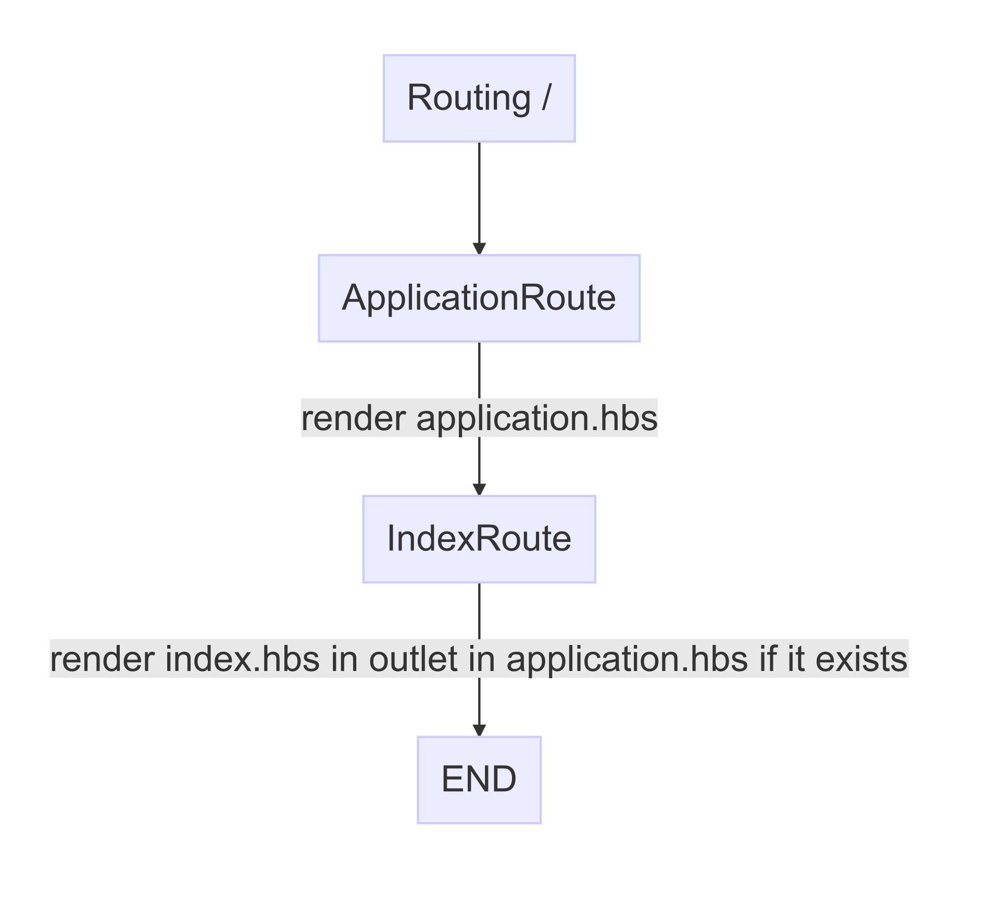

<!-- $theme: default -->

# Ember.js

Behind the scenes

---

## Summary

* 対象者
* Emberとは
* Ember.jsの各コンポーネントの役割の説明
  * Router Route Template Controller
  * Model Serializer Adapter Store
  * Service
  * Initializer
  * Component
* 実例をもとに上記を説明
  * Rails developerが混乱するところも

---


## 対象者

* Ember.jsでWebアプリをEmber-CLIを使って開発したことがある方

---

## Ember

* CoCがあるフレームワーク
* CoCを求めているならEmberは候補に入れてもいいはず！
* CoC = 知らないと逆に迷ったり分からなくなる
* 今日はそれについて、初心者(今でも初心者だけど)の私がハマった経験から、Emberではこうやる、やっている(Ember Way)というのを説明していきます
* RailsのMVCは忘れましょう(違うものです)


---

## Router

* 各URL(Route)の定義を行う
* Railsでいう `config/routes.rb` に相当
* Routeの定義をすると、Route/Controllerも作られる
* Railsとは違いコードは作成されず、メモリ上に展開される

---

## Route

* 各URL毎に存在する
* 暗黙的に作られるRouteがある(index)
* Emberを理解するには、まずRouteをしっかり理解する必要がある
* Routeを `router.js` で定義するとCoCで該当するRouteとControllerは作成される
  * RouteとControllerはファイルが存在しない(定義されていない)場合は、Emberのデフォルトのものが使われる
  * CoCに該当するTemplateファイルは必須

---

### Routeの役割

* サーバからAjaxでデータ(Model)をロード
* モデルをコントローラにセットしテンプレート上で参照できるようにする
* テンプレートの描画
* 画面の遷移に応じたフックメソッドがある
  * URLのクエリの変更を検知しデータをリロードした
* マウスクリックなどのイベントからアクションを実行する
* RailsのController部分の一部を担当している

---

## 例1 テンプレート描画の流れ


* `ember new $app_name`
* `ember s`
* `open http://localhost:4200/`

---

* トップページアクセスすると以下のように実行される
<p align="center">

</p>

---

### behind the scenes

こんなコードが裏で動いています(正確ではありません)

```js
// app/routes/application.js
Ember.Route.extend({
  renderTemplate() {
    this.render('application');
  },
});
```

```js
// app/routes/index.js
Ember.Route.extend({
  renderTemplate() {
    this.render('index', {
      into: 'application',
      outlet: 'main',
      controller: 'index',
    });
  },
});
```

---

```hbs
{{!-- app/templates/application.hbs --}}
<section>
  {{outlet}}
</section>
```


```hbs
{{!-- app/templates/index.hbs --}}
<h1>Index</h1>
```

```html
<!-- 出力: output -->
<section>
  <h1>Index</h1>
</section>
```

* `{{outlet}}` と `{{outlet 'main'}}` は同じ

---

## 例2 Routeを1つ定義してみる


```js
Ember.Router.map(function() {
  this.route('hello-world');
});
```


[chart](https://github.com/dopin/ember-tokyo-reborn/graphs/sample-01.mmd.png)

---

* トップページアクセスすると以下のように実行される

<p align="center">

</p>


---

## 例3 ApplicationError

* `beforeModel`、 `model`、`afterModel` で返した`Promise` が `reject` されると、`error`アクションが呼ばれ、テンプレートが存在すれば描画する

---

* /hello-world にアクセスした時に
* ApplicationRouteでエラーが起きた場合

---

## 例4 HelloWorldError

* /hello-world にアクセスした時に
* HelloWorldRouteでエラーが起きた場合


---

基本がわかったところで、さらに実践的なRouteを定義してみましょう

---

## Nested Route

リポジトリの一覧と詳細、編集ページの構成例

| path | description |
| --- | --- |
| /repositories | リポジトリ一覧  |
| /repositories/new | リポジトリ新規作成  |
| /repositories/:id | リポジトリ詳細 |
| /repositories/:id/edit | リポジトリ編集 |

---

Rails / Ember

```ruby
# config/routes.rb
resources :repository,
          only: [:index, :show, :edit, :new]
```

＝

```js
// app/router.js
Ember.Router.map(function() {
  this.route('repositories', function() {
    this.route('new');
    this.route('repository', { path: '/:id/' },　function() {
      this.route('edit');
    };
  });
});
```

---

### Rails

| path | controller | template |
| --- | --- | --- |
| /repositories | repositories#index | repositories/index.html.erb |
| /repositories/new | repositories#new | repositories/new.html.erb |
| /repositories/1 | repositories#show | repositories/edit.html.erb / repositories/repository/index.hbs  |
| /repositories/1/edit | repositories#edit | repositories/repository/edit.hbs |

* Railsは `app/views/layouts/application.html.erb` の中にデフォルトで各テンプレーを描画する


---

### Ember

| path | route | template |
| --- | --- | --- |
| /repositories | Repositories(Index)Route | repositories.hbs / repositories/index.hbs |
| /repositories/new | RepositoriesNewRoute | repositories/new.hbs |
| /repositories/1 | RepositoriesRepository(Index)Route | repositories/repository.hbs / repositories/repository/index.hbs  |
| /repositories/1/edit | RepositoriesRepositoryEditRoute | repositories/repository/edit.hbs |

* IndexRouteはRailsでいう `show` にあたる
* Emberは、親Routeの `{{outlet}}` の中にテンプレーを描画する
* 親Routeに `{{outlet}}` がないと何も表示されない

---

### Route Family

| path | route | parent |
| --- | --- | --- |
| /repositories | RepositoriesRoute | ApplicationRoute |
| /repositories/new | RepositoriesNewRoute | RepositoriesRoute  |
| /repositories/1 | RepositoriesRepositoryRoute | RepositoriesRoute |
| /repositories/1 | RepositoriesRepositoryIndexRoute | RepositoriesRepositoryRoute |
| /repositories/1/edit | RepositoriesRepositoryEditRoute | RepositoriesRepositoryRoute |

---

### Tree

<p align="center">

</p>

---

### Path To RepositoriesRepositoryEditRoute

* ブラウザのアクセスか、直接URLを叩いた場合

<p align="center">

</p>

---

### Path To RepositoriesRepositoryEditRoute

<p align="center">

</p>

---

### From RepositoriesIndexRoute

* `{{link-to 'reposotories.repository.edit'}}`

<p align="center">

</p>

* `RepositoriesRepositoryRoute` => `RepositoriesRepositoryEditRoute`
* 親Routeのフックメソッドは実行されない